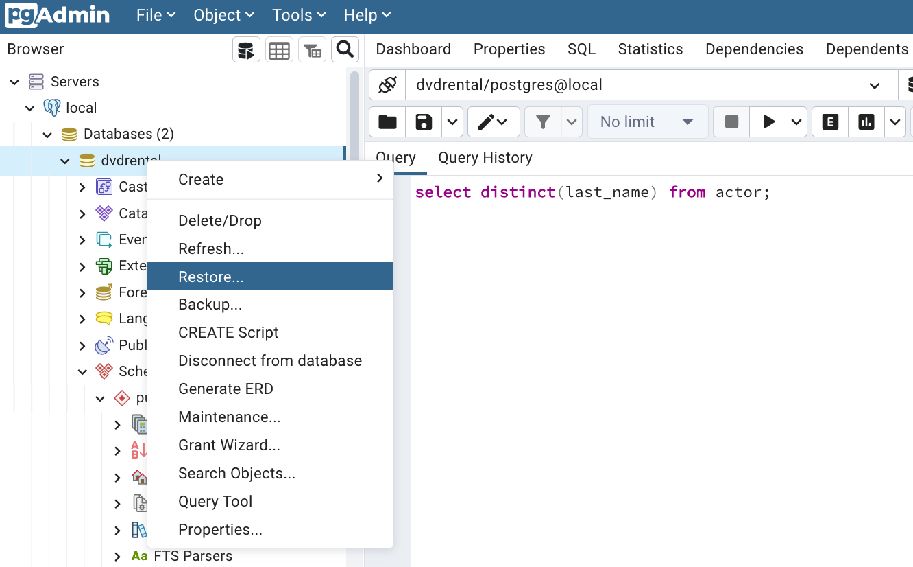

# PostgreSQL

[Postgresql](https://www.postgresql.org/) is open source object-relational database system with over 30 years of active development that has earned it a strong reputation for reliability, feature robustness, and performance.

PostgreSQL features ACID (Atomicity, Consistent, Isolation and Durability) properties. It has indexes (primary/unique), updatable views, triggers, foreign keys (FKs) and even stored procedures (SPs)

## Value propositions

* Oldest open source RDBMS and advanced one, and is object-relational database
* Large dataset
* A lot of data types and support unstructured data too.
* Adopted in microservice world.
* Run in multiple process so better for horizontal scaling
* Suited for applications with high volume of both reads and writes
* Consider PostgreSQL for any application that might grow to enterprise scope, with complex queries and frequent write operations. 
* Includes `pgbench` to be used to create data and also to stress the database. 

## Architecture for HA

The PostgreSQL stack is comprised of a primary and replica services. WAL records are exchanged between primary and replicas.

{ width="600" }

Streaming replication is pushing changes from a primary PostgreSQL instance to its replicas.

* [Product documentation on warm standby](https://www.postgresql.org/docs/current/warm-standby.html)

### My Projects using postgresql

* [Vaccine order mgr](https://github.com/ibm-cloud-architecture/vaccine-order-mgr-pg)
* In this project there is a copy of Quarkus - panache - postgresql quickstart with settings to access remote postgresql on IBM Cloud and kubernetes template for a secret to get URL, user and password to access the DB.  
* [Autonomous Car Ride]()
* [CDC Debezium demo with Flink](https://github.com/jbcodeforce/flink-studies/tree/master/e2e-demos/cdc-demo)

## Create Postgres databases

### Run Postgres locally with docker

* Using docker command:

```shell
docker run --ulimit memlock=-1:-1 -it --rm=true --memory-swappiness=0 --name pgdb -e POSTGRES_USER=pguser -e POSTGRES_PASSWORD=passw0rd -e POSTGRES_DB=bettertodo -p 5432:5432 postgres:10.5
```

Or set the environment variables `POSTGRESQL_USER,POSTGRESQL_HOST, POSTGRESQL_PWD` in the .env script and then use the command: `source .env`.


Under the postgresql folder there are a set of commands to run postgresql with docker and even on k8s

* start the docker image for the database: `./startPostgresqlLocal.sh`
* Start bash in a postgres image to access psql: `./startPsql.sh LOCAL`

* Another way is to use docker compose:

```yaml
 postgresql:
    container_name: postgres
    hostname: postgres
    image: postgres
    environment:
      POSTGRES_USER: postgres
      POSTGRES_PASSWORD: pgpwd
      POSTGRES_DB: ordersdb
    ports:
      - "5432:5432"
    volumes:
      - ./database:/var/lib/postgresql/data/
```

If you need to add table creation script to run when the container starts, add the following lines in the volumes

```yaml
      # copy the sql script to create tables
      - ./sql/create_tables.sql:/docker-entrypoint-initdb.d/create_tables.sql
```

The official PostgreSQL Docker image https://hub.docker.com/_/postgres/ allows us to place SQL files in the /docker-entrypoint-initb.d folder, and the first time the service starts, it will import and execute those SQL files.

### Kubernetes deployment

There is a kubernetes operator for postgresql [CloudNativePG](https://cloudnative-pg.io/) that can be install with [install instructions](https://cloudnative-pg.io/documentation/1.25/installation_upgrade/):

```sh
# verify, as it takes sometime the first time
kubectl describe deployment -n cnpg-system cnpg-controller-manager
```

See the [Quickstart](https://github.com/cloudnative-pg/cloudnative-pg/blob/main/docs/src/quickstart.md) . 
The default configuration of the CloudNativePG operator comes with a Deployment of a single replica, which is suitable for most demonstrations.

Define a PG cluster, see [pg-cluster](https://github.com/jbcodeforce/flink-studies/blob/master/e2e-demos/flink-to-sink-postgresql/k8s/pg-cluster.yaml). By default, the operator will install the latest available minor version of the latest major version of PostgreSQL when the operator was released.

```sh
k apply -f pg-cluster.yaml
```

To deploy the PGadmin web app use the deployment: `pgadmin-deploy.yaml`. 

[Cloud Native Postgresql K8S operator.](https://cloudnative-pg.io/) to deploy Posgresql using CRD. and [installation](https://github.com/cloudnative-pg/cloudnative-pg/blob/main/docs/src/installation_upgrade.md).


Access to the psql cli via:

```sh
k get pods -n pgdb
k exec -ti -n pgdb pg-cluster-1 -c postgres -- psql -x -c "SHOW timezone"  
k exec -ti -n pgdb pg-cluster-1 -c postgres  -- bash
```

### pgAdmin

The docker compose includes the pgAdmin UI at address http://localhost:5050. See user and password in docker compose. Register a server by using postgres as hostname, user and password.

* We can create a new database (dvdrental for example) and load definition and data from a backup which is a tar file.

  

* Use the `Query Tool` to execute SQL command.

We can load csv file in a table. Example from cab_rides for flink study: 

1. Be sure the csv file is mounted inside the docker container
1. Create a table matching the columns of the csv with the expected types

  ```sql
  CREATE TABLE cab_rides(
  cab_id VARCHAR(20), 
  cab_plate VARCHAR(20), 
  cab_type VARCHAR(20), 
  driver_name VARCHAR(100), 
  ongoing_trip VARCHAR(4), 
  pickup_location VARCHAR(20), 
  destination VARCHAR(20), 
  passenger_count INTEGER
  );
  ```

1. Enter a query like

    ```sql
    COPY cab_rides FROM '/tmp/data_files/cab_rides.csv' DELIMITER ',';
    # Or if the first raw has a header
    COPY cab_rides FROM '/' DELIMITER ',' CSV HEADER;
    ```

* Can also use the backup and restore functions on the database to load data and schema: use the upload file button on top left of the user interface.

### Some psql commands

[See psqk commands documentation.](https://www.postgresql.org/docs/current/app-psql.html)

```shell
# connect to the container
docker exec -ti pgdb bash
# start psql using the user specified
psql -U pguser -d dbname
# for k8s deployment: first exec to the pod: k exec -ti -n pgdb pg-cluster-1 -c postgres  -- bash
psql "host=pg-cluster-rw user=app dbname=app password=apppwd"
# switch to another DB
\c dbname
# list existing DBs
\l
# list available tables
\dt 
# describe table
\d table_name
# list schemas
\dn
# list available funtions
\df
# views
\dv
# list users
\du
# command history
\s
# execute previoud commmand
\g
# Execute a SQL query
select * from public.tablename;
create table customers(id integer not null primary key, name varchar(20));
```

See [puzzles](https://github.com/jbcodeforce/db-play/tree/master/postgresql/puzzles/)


### Deploy postgresql on OpenShift

#### Using deployment

See the script deployPostgresOnOpenShift.sh.

#### Using Operator

In the 'developer perspective` of OpenShift console, use the database and a postgresql without persistence, or ephemeral. Set the DB name, user and password. See [this OpenShift tutorial for more info](https://docs.openshift.com/enterprise/3.1/using_images/db_images/postgresql.html#configuration-and-usage).

The environment variables are defined as secrets under the postgresql namespace: `oc describe secret postgresql`

Remote connect to the postgresql pod: `oc rsh podid`

Then start `psql` using the following command: 

```shell
PGPASSWORD=$POSTGRESQL_PASSWORD psql -h postgresql -d $POSTGRESQL_DATABASE -U $POSTGRESQL_USER
psql (10.12)
Type "help" for help.

vaccinedb=>
```

To access the database with pgadmin running locally, to the remote DB, we need to do port forwarding as:

```shell
oc get pods
oc port-forward postgres-5f449ccd95-tclb6 15432:5432
```

In pGAdmin efine the server entry with the connection to the port 15432.

Then in the Quarkus app or in env file define properties like:

```shell
export QUARKUS_DATASOURCE_USERNAME=postgres
export QUARKUS_DATASOURCE_PASSWORD=postgres1234
export POSTGRESQL_DBNAME=postgres
export QUARKUS_DATASOURCE_JDBC_URL=jdbc:postgresql://localhost:15432/postgres

```

## Some SQL examples

See [main page for SQL examples on postgresql DB like dvdrentals, or facilities rental](./index.md).

### Exercises from medium articles

* [SQL Questions with Detailed Answers (Step-by-Step)](https://medium.com/@anna.wu9222/sql-questions-with-detailed-answers-step-by-step-2459f6e110b), see the sql scripts in the postgresql/medium1 folder.

  * Start docker compose as it mount the ./medium1 folder into /tmp/scripts
  * Create the tables in the postgres db

  ```sh
  # under /tmp/scripts
  psql -U postgres -f create_db.sql
  ```
  
  * insert records `psql -U postgres -f inser-record-1.sql`
  * **Write an SQL query to report all customers who never order anything**. Use left join to take all the values from the left table and the common rows from the right table. The left join was performed on the Customer table because we want all the Customers with their Orders.

  ```sql
  select * from customers left join orders on customers.id = orders.customer_id;
 
  id | name  | id | customer_id 
  ----+-------+----+-------------
    3 | Sam   |  1 |           3
    1 | Joe   |  2 |           1
    2 | Henry |    |            
    4 | Max   |    |   

  select name from customers left join orders on customers.id = orders.customer_id where orders.customer_id is null; 
  ```


### Create customers

Here is the complete SQL you can run in psql

```sql
CREATE TABLE customers (customer_id varchar(8) PRIMARY KEY, lastname varchar(40) NOT NULL, firstname varchar(40) NOT NULL, zipcode varchar(5), country varchar(40), status integer);
INSERT INTO customers (customer_id,lastname,firstname,zipcode,country,status) VALUES
('C01','Builder','Bob','95050','USA',1),
('C02','Destroyer','Bill','95050','USA',1),
('C03','Climber','Jack','95052','USA',1),
('C04','Messenger','John','95052','USA',1);
```

or use the command

```shell
psql postgres://$POSTGRES_USER:$POSTGRES_PWD@$POSTGRES_HOST/$POSTGRES_DB -a -f /home/dll/customer.sql
``` 

### Create products

Products define fresh product with controlled temperature and humidity to control for the travel.

```sql
CREATE TABLE products (
    product_id varchar(64) NOT NULL PRIMARY KEY,
    description varchar(100),
    target_temperature REAL,
    target_humidity_level REAL,
    content_type integrer
);

INSERT INTO products(product_id,description,target_temperature,target_humidity_level,content_type) VALUES
('P01','Carrots',4,0.4,1),
('P02','Banana',6,0.6,2),
('P03','Salad',4,0.4,1),
('P04','Avocado',6,0.4,1),
('P05','Tomato',4,0.4,2);
```

```shell
psql postgres://$POSTGRES_USER:$POSTGRES_PWD@$POSTGRES_HOST/$POSTGRES_DB -a -f /home/dll/product.sql
```

## Hibernate ORM

See code for [order management](https://github.com/ibm-cloud-architecture/vaccine-order-mgr-pg)

## High Availability

For HA the principle is to try to get a second server to take over quickly in case of primary server failure, or to have several nodes to serve the same data.
Multiple solutions exist to support HA, the synchronous one consider that a data-modifying transaction is not considered committed until all servers have committed the transaction.

* **shared disk (hardware) failover**: avoids synchronization overhead by having only one copy of the database. standby server is able to mount and start the database as though it were recovering from a database crash
* **File system - block storage** writes to the standby must be done in the same order as those on the primary.
* **Write-Ahead Log Shipping**
* **Logical replication** PostgreSQL logical replication constructs a stream of logical data modifications from the Write-Ahead Log. Logical replication allows replication of data changes on a per-table basis
* **Trigger-Based Primary-Standby Replication** asynch replication from primary to standby servers
* **SQL-Based Replication Middleware**:  a program intercepts every SQL query and sends it to one or all servers
* **Synchronous Multimaster Replication** each server accept write requests,  modified data is transmitted from the original server to every other server before each transaction commits.
* **Asynchronous Multimaster Replication** each server works independently, and periodically communicates with the other servers to identify conflicting transactions which can be resolved by DB admin.

## Use python to interact with the DB

* install psycopg2

```
pip install psycopg2
```

* Reading table content

```python
```

* Writing new content

```python
```

## More readings

* [How to Run PostgreSQL and pgAdmin Using Docker](https://towardsdatascience.com/how-to-run-postgresql-and-pgadmin-using-docker-3a6a8ae918b5)

## AWS Aurora


## IBM Cloud

### Create an instance of Postgresql on IBM Cloud

No need to reinvent the [product documentation](https://cloud.ibm.com/services/databases-for-postgresql) to create one instance. A summary of what needs to be done

* Set user admin password:

```
ibmcloud cdb user-password <instance name> admin alongpassw0rd
```

* Get URL to connect to the service: URL, Port number

* Get SSL certificate for client using ibm cloud CLI

```shell
ibmcloud cdb deployment-cacert Green-DB-PostgreSQL > postgres.crt
```

* Use `pgAdmin4` to administer postgres: add a server and complete the ULR, port, admin as user and the password set in previous step.

```shell

docker run -p 5050:80 -d -e PGADMIN_DEFAULT_EMAIL=admin -e PGADMIN_DEFAULT_PASSWORD=alongpassw0rd dpage/pgadmin4
# http://localhost:5050/browser/

```
