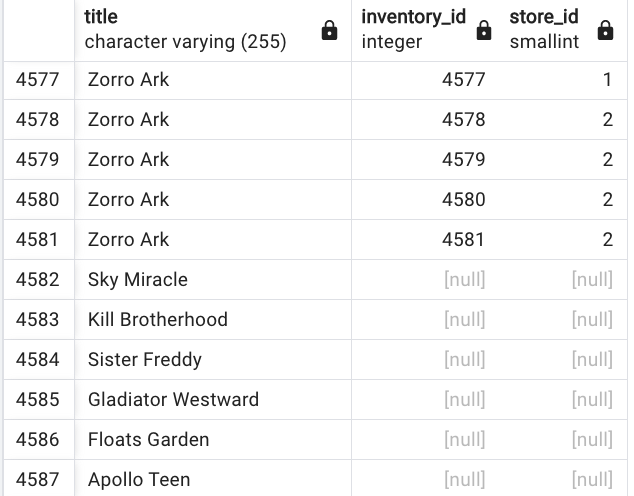

# SQL Language

This chapter is dedicated to common SQL implementation, including complex statements.

### WITH

The WITH clause allows to create temporary named result sets that exist only for the duration of the query. It is like creating a temporary view or defining a sub-query that we can reference multiple times.
It is named **CTE for Common Table Expressions**.

```sql
WITH cte_name AS (
    SELECT column1, column2
    FROM table_name
    WHERE condition
)
SELECT * FROM cte_name;
```

Can be used for recursive queries: Like get the list of employees

```sql
WITH RECURSIVE employee_hierarchy AS (
    -- Base case: get top-level employees
    SELECT employee_id, name, manager_id, 1 as level
    FROM employees
    WHERE manager_id IS NULL
    
    UNION ALL
    
    -- Recursive case: get subordinates
    SELECT e.employee_id, e.name, e.manager_id, h.level + 1
    FROM employees e
    JOIN emp_hierarchy h ON e.manager_id = h.employee_id
)
SELECT * FROM emp_hierarchy;
```


### Joins

A JOIN combines rows from two or more tables based on a related column between them. There are several types of JOINs:

#### INNER JOIN

Te goal is to build a projection of all elements in table A also present in table B. Get all columns of both tables:

```sql
SELECT * FROM table_a INNER JOIN table_b on table_a.column = table_b.column_b
```

```sql
-- Returns only the matching rows from both tables
SELECT employees.name, departments.dept_name
FROM employees
INNER JOIN departments 
    ON employees.dept_id = departments.id;
```

It is used to find matches between tables, or to get complete records only.


* Get the top 10 customer name who do the most renting

```sql
select first_name, last_name, count(*) from payment 
inner join customer 
on payment.customer_id = customer.customer_id 
group by first_name, last_name 
order by count(*) desc limit 10;
```

```sql
-- get email address of customer leaving in california
select district, email from customer
join address
on address.address_id = customer.address_id
where address.district = 'California'
```

#### LEFT (OUTER) JOIN

OUTER JOIN is used to deal with column only in one table.  Returns all rows from left table and matching rows from right table.

```sql
SELECT employees.name, departments.dept_name
FROM employees
LEFT JOIN departments 
    ON employees.dept_id = departments.id;
-- Will show all employees, even those without departments
```

It is used for checking for missing records, or to report with all records from a main table.

Another example:

```sql
select title, inventory_id, store_id from film 
left join inventory 
on film.film_id = inventory.film_id
```

#### RIGHT (OUTER) JOIN:

Returns all rows from right table and matching rows from left table.

```sql
SELECT employees.name, departments.dept_name
FROM employees
RIGHT JOIN departments 
    ON employees.dept_id = departments.id;
-- Will show all departments, even those without employees
```

#### FULL OUTER JOIN

Returns all rows from both tables.

```sql
-- full outer join - customer never buy anything
select * from customer 
full outer join payment 
on payment.customer_id = customer.customer_id
where customer.customer_id IS null;
-- set of records that are in the left table, present or not in the right
```

Another example:

```sql
-- film in catalog not in the inventory
select title, inventory_id, store_id from film 
left join inventory 
on film.film_id = inventory.film_id
where inventory_ID IS null
```




#### Combining Joins

```sql
-- Example with three tables
SELECT 
    e.name AS employee_name,
    d.dept_name,
    p.project_name
FROM employees e
INNER JOIN departments d 
    ON e.dept_id = d.id
LEFT JOIN projects p 
    ON e.project_id = p.id
WHERE d.location = 'New York';
```

#### Some practices

* Always use table aliases for better readability
* Specify the JOIN type explicitly (don't rely on implicit joins)
* Be careful with OUTER JOINs as they can impact performance
* Use appropriate indexes on join columns
* Consider the order of joins when working with multiple tables


* What are the film with a given actor?

    ```sql
    select  title,first_name, last_name from film_actor as fa
    inner join actor
    on actor.actor_id = fa.actor_id
    inner join film
    on fa.film_id = film.film_id
    where last_name = 'Wahlberg' and first_name = 'Nick'
    ```

* Film returned on a specific date: uses subquery, and joins

    ```sql
    select film_id,title from film
    where film_id in
    (select inventory.inventory_id from rental 
    inner join inventory
    on inventory.inventory_id = rental.inventory_id
    where rental.return_date between '2005-05-29' and ' 2005-05-30')
    ORDER BY title
    ```