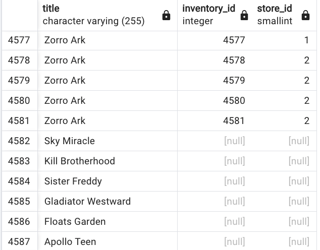

# Intermediate SQL

This chapter is dedicated to summarize common major SQL constructs. The [following tutorial has a lot of very good examples for deeper study.](https://www.sqltutorial.org/)


* Protect against null for value and substitute using COALESCE

```sql
select product, (price - coalesce(discount,0)) from products;
```

### Play with timestamp

```sql
-- get the year of a date
select extract(year from payment_date) as myyear from payment;
-- can use month, quarter, month, day
-- get how old is a record
select AGE(payment_date) from payment;
--
select TO_CHAR(payment_date, "MM-DD-YYYY") from payment;
```

### Mathematical functions

Compute things from columns. [Examples from postgresql](https://www.postgresql.org/docs/9.5/functions-math.html)

* Get list of students who scored better than average grade

```sql
-- avg grade
select AVG(grade) from test_scores
-- solution with subquery
select student, grade from test_scrores
where grade > ( select AVG(grade) from test_scores);
```

### Self-join

A query in which table is joined to itself: used to compare values in a column of rows within the same table. Need to use aliases. Get the employe's name and the name of his manager:

```sql
select emp.name, report.name as manager from employees as emp
join employees as report 
on emp.emp_id = report.report_id 
```

* find the films with the same length presented as pair

```sql
from f1.title, f2.title, f1.length from film as f1
inner join film as f2
on f1.film_id != f2.film_id and f1.length = f2.length
```

* Compare the various amounts of films per movie rating

```sql
select
sum(CASE rating
    WHEN 'R' THEN 1
    ELSE 0
END) as R,
sum(CASE rating
    WHEN 'PG' THEN 1
    ELSE 0
END) as PG,
sum(CASE rating
    WHEN 'PG-13' THEN 1
    ELSE 0
END) as PG13
from film
```


### Add views

It is a stored query to be executed often.

```sql
create view customer_info as 
SELECT ... -- the sql to repeat
```

### Remove duplicates

```sql
-- search for same transaction
SELECT transaction_id, COUNT(transaction_id)
FROM Transaction__Table
GROUP BY transaction_id
HAVING COUNT(transaction_id) > 1;
-- 
```

## WITH

The WITH clause allows to create temporary named result sets that exist only for the duration of the query. It is like creating a temporary view or defining a sub-query that we can reference multiple times.
It is named **CTE for Common Table Expressions**.

```sql
WITH cte_name AS (
    SELECT column1, column2
    FROM table_name
    WHERE condition
)
SELECT * FROM cte_name;
```

Can be used for recursive queries: Like get the list of employees of their manager up to the CEO:

```sql
WITH RECURSIVE employee_hierarchy AS (
    -- Base case: get top-level employees
    SELECT employee_id, `name`, manager_id, 1 as level
    FROM employees
    WHERE manager_id IS NULL
    
    UNION ALL
    
    -- Recursive case: get subordinates
    SELECT e.employee_id, e.name, e.manager_id, h.level + 1
    FROM employees e
    JOIN emp_hierarchy h ON e.manager_id = h.employee_id
)
SELECT * FROM emp_hierarchy;
```


## Joins

A JOIN combines rows from two or more tables based on a related column between them. There are several types of JOINs:

### INNER JOIN

Te goal is to build a projection of all elements in table A also present in table B. Get all columns of both tables:

```sql
SELECT * FROM table_a INNER JOIN table_b on table_a.column = table_b.column_b
```

```sql
-- Returns only the matching rows from both tables
SELECT employees.name, departments.dept_name
FROM employees
INNER JOIN departments 
    ON employees.dept_id = departments.id;
```

It is used to find matches between tables, or to get the complete records only.


* Get the top 10 customer name who do the most renting

```sql
select first_name, last_name, count(*) from payment 
inner join customer 
on payment.customer_id = customer.customer_id 
group by first_name, last_name 
order by count(*) desc limit 10;
```

```sql
-- get email address of customer leaving in california
select district, email from customer
join address
on address.address_id = customer.address_id
where address.district = 'California'
```

### LEFT (OUTER) JOIN

OUTER JOIN or LEFT JOIN is used to deal with column only in the left side table.  Returns all rows from left table, matching row from right table, or null if no match: 

```sql
SELECT employees.name, departments.dept_name
FROM employees
LEFT JOIN departments 
    ON employees.dept_id = departments.id;
-- Will show all employees, even those without departments
```

It is used for checking for missing records, or to report with all records from a main table.

Another example:

```sql
select title, inventory_id, store_id from film 
left join inventory 
on film.film_id = inventory.film_id
```

Some films may not be in the current inventory.

### RIGHT (OUTER) JOIN:

Returns all rows from right table and matching rows from left table.

```sql
SELECT employees.name, departments.dept_name
FROM employees
RIGHT JOIN departments 
    ON employees.dept_id = departments.id;
-- Will show all departments, even those without employees
```

### FULL OUTER JOIN

Returns all rows from both tables.

```sql
-- full outer join - customer never buy anything
select * from customer 
full outer join payment 
on payment.customer_id = customer.customer_id
where customer.customer_id IS null;
-- set of records that are in the left table, present or not in the right
```

Another example:

```sql
-- film in catalog not in the inventory
select title, inventory_id, store_id from film 
left join inventory 
on film.film_id = inventory.film_id
where inventory_ID IS null
```



### Combining Joins

```sql
-- Example with three tables
SELECT 
    e.name AS employee_name,
    d.dept_name,
    p.project_name
FROM employees e
INNER JOIN departments d 
    ON e.dept_id = d.id
LEFT JOIN projects p 
    ON e.project_id = p.id
WHERE d.location = 'New York';
```

### Some practices

* Always use table aliases for better readability
* Specify the JOIN type explicitly (don't rely on implicit joins)
* Be careful with OUTER JOINs as they can impact performance
* Use appropriate indexes on join columns
* Consider the order of joins when working with multiple tables


* What are the film with a given actor?

    ```sql
    select  title,first_name, last_name from film_actor as fa
    inner join actor
    on actor.actor_id = fa.actor_id
    inner join film
    on fa.film_id = film.film_id
    where last_name = 'Wahlberg' and first_name = 'Nick'
    ```

* Film returned on a specific date: uses subquery, and joins

    ```sql
    select film_id,title from film
    where film_id in
    (select inventory.inventory_id from rental 
    inner join inventory
    on inventory.inventory_id = rental.inventory_id
    where rental.return_date between '2005-05-29' and ' 2005-05-30')
    ORDER BY title
    ```

## OVER

The OVER clause in SQL is a powerful operator that transforms how aggregate functions (like SUM, AVG, COUNT, MAX, MIN) and other window functions (like ROW_NUMBER, RANK, LEAD, LAG) operate. Instead of grouping rows into a single summary row (like a traditional GROUP BY clause), the OVER clause allows these functions to perform calculations across a set of related rows while still returning each individual row of the original result set.

For example calculating the running total of the transactions seen so far, by also generating each transaction:

```sql
tx_id, tx_date, amount, running_total
74	"2024-06-14"	626.69	626.69
2	"2024-06-20"	793.97	1420.66
90	"2024-06-26"	397.17	1817.83
88	"2024-06-30"	290.69	2108.52
78	"2024-07-01"	245.87	2354.39
```

```sql
SELECT transaction_id, transaction_date, amount, sum(amount) over (order by transaction_date) as running_total 
FROM sales;
```

* **Common Use Cases for the OVER Clause:**

    * Running Totals: Calculating a cumulative sum or count as you go through the data.
    * Moving Averages: Calculating the average of a specific number of preceding and/or following rows.
    * Ranking: Assigning ranks to rows within a group (e.g., ROW_NUMBER(), RANK(), DENSE_RANK(), NTILE()).
    * Percentage of Total: Calculating what percentage each row's value contributes to a total for its group.
    * Comparing to Previous/Next Rows: Using LAG() to get a value from a previous row or LEAD() to get a value from a subsequent row within a partition.
    * First/Last Value in a Group: Retrieving the FIRST_VALUE() or LAST_VALUE() in a defined window.

**Examples of queries**

| Problem | Queries|
| --- | --- |
|Calculate the total sales for each salesperson | SELECT SalesPerson, SaleDate, SaleAmount, SUM(SaleAmount) OVER (PARTITION BY SalesPerson) AS TotalSalesPerPerson FROM Sales; |
| Rank sales within each salesperson's record | SELECT SalesPerson, SaleDate, SaleAmount, ROW_NUMER() OVER (PARTITION BY SalesPerson ORDER BY SaleAmount DESC) AS SaleRank  FROM Sales;| 
| Calculate a running total of sales for each salesperson, ordered by date |  SELECT SalesPerson, SaleDate, SaleAmount, SUM(SaleAmount) OVER (PARTITION BY SalesPerson ORDER BY SaleDat) AS RunningTotal FROM Sales;|

### See classical SQL puzzles

See [puzzles](https://github.com/jbcodeforce/db-play/tree/master/postgresql/puzzles/) with instructions and code explanations in each sql file.